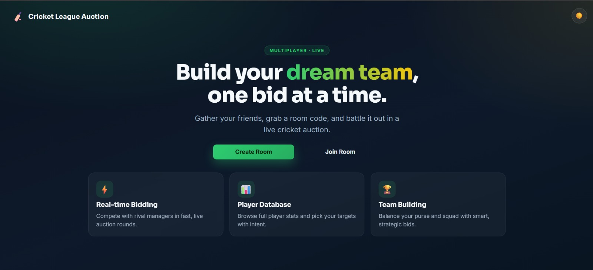
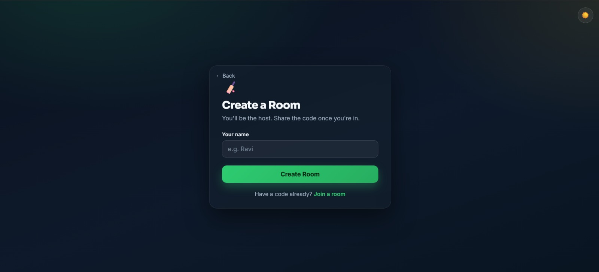
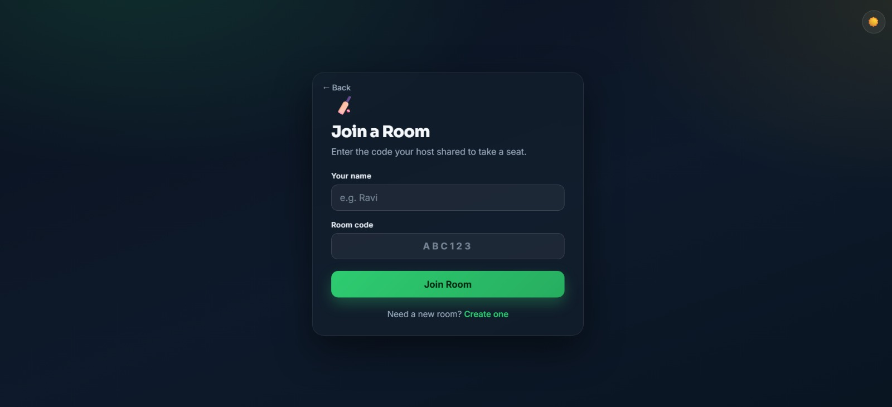
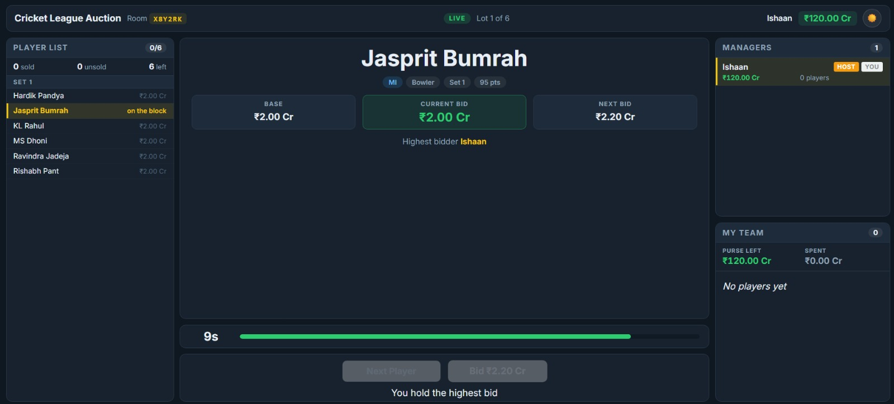
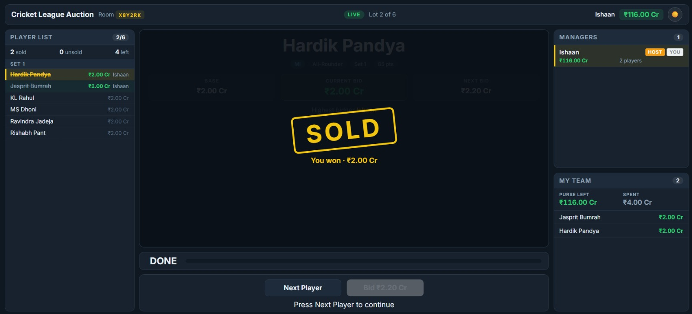

# Cricket League Auction

Run your own IPL-style player auction with friends. One of you hosts, everyone
else joins with a room code, and you bid against each other in real time for a
squad. Same purse, same clock, same players, no spreadsheets.

Every manager starts with **₹120 Cr**. Players come up one at a time on a
ten-second clock. Outbid your friends, or hold your money for someone better
later.

## Screens



Create a room and you are the host. Everyone else joins with the six-character
code you share.

| Create | Join |
|---|---|
|  |  |

The auction itself is one fixed, non-scrolling screen: the full player ledger on
the left, the player on the block in the middle, managers and your own squad on
the right. Everyone sees the same countdown at the same time.



When the clock runs out the player is sold. The ledger strikes them off, the
winner's purse is debited, and the stamp reads **You won** in gold if you were
the one who took them.



## How to play

**Getting everyone in.** One person picks **Create Room** and becomes the host.
They get a six-character code. Share it, and everyone else joins with
**Join Room** using that code and their name. Up to **10 managers** per room.
Once everyone is in, the host presses **Start Auction**.

**Your money.** Everyone starts with **₹120 Cr**. Whatever you spend comes
straight off your purse, and you can never bid more than you have left. The BID
button simply stops working once the next bid is out of reach.

**How a player is sold.** Players come up one at a time. Each has a base price,
and the first bid is *at* that base price, so you don't have to beat it, just be
willing to pay it. After that, every bid steps up by a fixed increment:

| Current price | Next bid goes up by |
|---|---|
| Under ₹1 Cr | ₹5 L |
| Under ₹2 Cr | ₹10 L |
| Under ₹9.95 Cr | ₹20 L |
| ₹9.95 Cr and above | ₹50 L |

You never type an amount. The BID button shows exactly what you would pay, and
you either take it or you don't.

**The clock.** A player stays open for **10 seconds**. Every bid resets it back
to the full ten, so a last-second snipe just gives everyone else another ten
seconds to answer. When the clock hits zero the highest bidder wins them. No
bids at all and the player goes **UNSOLD**.

**Two rules that catch people out.**

- You can't bid against yourself. If you already hold the highest bid, the
  button stays disabled until somebody else raises.
- If two of you click at the same instant, only the first click counts. The
  other person gets *"Too slow, someone else bid first"* along with the new
  price. You are never charged a price you didn't see on the button, so if you
  still want the player, click again at the new number.

**Running the room.** Only the host advances the auction: **Next Player** after
each sale, and **Finish Auction** after the last one. The host can also remove
someone from the room. If anyone disconnects, the auction pauses for everybody
until they are back, so nobody wins a player because a rival's WiFi dropped.

**The end.** After the last player, everyone sees the full results: every squad,
what each manager spent, and the players nobody bought.

## Why the player order is shuffled

Each room gets its own randomised running order, so you can't memorise it.

A fixed order would be learnable. Replay the auction and you would know exactly
who is coming, letting you plan all ₹120 Cr in advance. That removes the only
real decision in the game: bid now, or save for someone better later? Shuffling
forces that choice under genuine uncertainty.

The shuffle happens **within each set**, and sets are skill tiers, so the
marquee names still come up early, while purses are full and the bidding is
brutal. It also spreads out positional bias, since whoever appears first always
faces the richest table.

## Run it locally

Needs Node 18+ and a MongoDB running on `localhost:27017`.

```bash
# 1. Server
cd server
cp .env.example .env         # defaults point at local MongoDB
npm install
npm run seed                 # loads 40 players across 5 sets
npm start                    # http://localhost:3000

# 2. Client (second terminal)
cd client
cp .env.example .env
npm install
npm run dev                  # http://localhost:5173
```

Then open `http://localhost:5173`.

To try it solo, open two browser windows, one normal and one incognito, so they
get separate cookies and count as two different people. Create a room in the
first and join with that code in the second.
